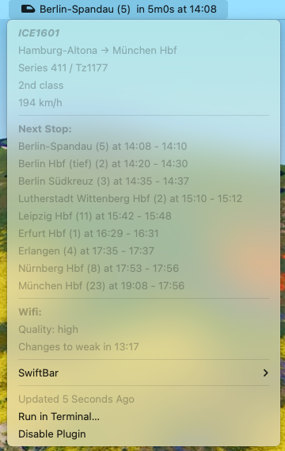

# ICEportal - a (swift|x|bit)bar display for the current ICE trip
This swiftbar plugin is a Go (and Mac) port of the [waybar-iceportal](https://cyberchaos.dev/e1mo/waybar-iceportal) plugin by [e1mo](https://cyberchaos.dev/users/e1mo/projects). When on a Deutsche Bahn ICE train it queries the onboard iceportal api and displays the upcoming station as well as the next stops, wifi quality and train speed.

## Requirements
Go
### Recomendations
I recommend to compile the binary and put it in to `~/.swiftbar/iceportal.1m.cgo` because of one external dependency for the cookiejar.

## Testing
this is more or less a WIP since I only tested against the test data provided by @e1mo. I will verify it on my next journey and upload some more test data.
To test on your own I recommend to set `local = true`. It will use the json files in `testdata/`